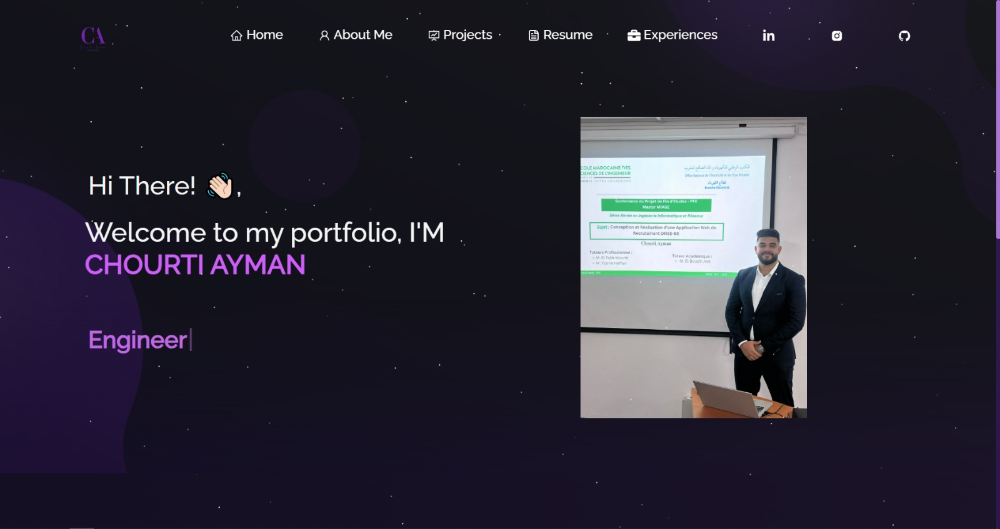

<h1 align="center">Welcome to Portfolio 👋</h1>
<p>
  
  <a href="https://twitter.com/Aymanchourti" target="_blank">
    
  </a>
</p>


> note

### 🏠 [Homepage](home)




### ✨ [Demo](https://chourti-portfolio.vercel.app)

## Install

```sh
npm install
```

## Usage

```sh
npm run start
```

## Run tests

```sh
npm run test
```

## Author

👤 **Ayman_Chourti**

* Website: https://www.linkedin.com/in/ayman-chourti-b95a28246/
* Twitter: [@Aymanchourti](https://twitter.com/Aymanchourti)
* Github: [@Chourti](https://github.com/Chourti)
* LinkedIn: [@Ayman Chourti](https://linkedin.com/in/Ayman Chourti)

## Show your support


***
_This README was generated with ❤️ by [readme-md-generator](https://github.com/kefranabg/readme-md-generator)_
